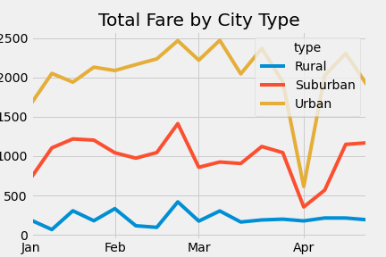

# PyBer Analysis

## Overview
I created a summary of ride-sharing data by city type.  Then I created a multiple-line graph that shows the total weekly fares for each city type from January through April 2019.  The goal is to find differences in ride-sharing data by city type to help the decision-makers at PyBer.

## Results

- Deliverable 1: A ride-sharing summary DataFrame by city type 
-- The below figure shows the total rides, total drivers, total fares, average fare per ride, and average fare per driver by ciy type.

- Deliverable 2: A multiple-line chart of total fares for each city type
-- The below figure shows the total fare by city type from January through April 2019.

## Summary
1. In rural cities, fares are more expensive per ride than in urban and suburban cities; however, drivers make significantly less money.
2. In suburban cities, fares are more expensive per ride than for urban cities but less than rural cities.  Drivers make more money than in rural cities but still make significantly less money than in urban cities.
3. In urban cities, fares are the least expensive per ride, and drivers make the most money.
